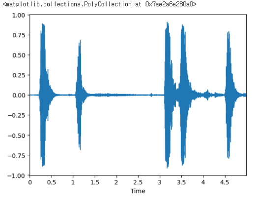
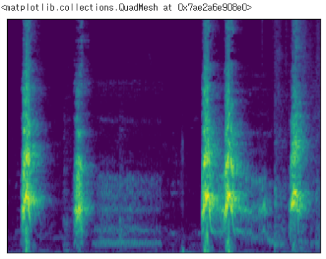

# 주변 환경 소리 분석
1. [분리](#분리)
2. [분류](#분류)
---
# 분리
주변 환경의 중첩된 소리를 단일 소리로 분리

## Demucs
[Demucs](https://github.com/facebookresearch/demucs) is a music source separation model that supports drum, bass, and vocal separation based on U-Net convolutional architecture.

우리는 Demucs를 사용해 **하나의 input 파일당 4개의 output 파일을 생성**했다.

---
# 분류
각각의 단일 소리를 분석해 어떤 소리인지 분류

## Dataset
ESC-50, AI-Hub 소음 환경 음성인식 데이터, UrbanSound8K

+ __630개의 데이터__
  + Train Data 513개
  + Validation Data 117개

+ __11개의 카테고리__
  + dog
  + cat
  + rain
  + wind
  + thunderstorm
  + human
  + conversation
  + siren
  + car horn
  + train
  + steet_music

## 데이터 전처리
### librosa
**오디오 데이터 분류를 위해서** 소리의 특징을 추출해야 하기 때문에 음악과 소리 분석 라이브러리인 [librosa](https://github.com/librosa/librosa)를 사용

### melspectrogram
**특징 추출을 위해서** 주파수 단위를 사람이 듣는 소리 단위인 멜 단위로 바꾼 스펙트럼인 멜스펙트로그램을 사용.

+ __def get_melspectrogram_db__
: 이 함수로 오디오 데이터를 멜스펙트로그램 형태로 변환하고, dB(데시벨) 스케일로 변환하여 주파수 변화를 눈으로 쉽게 확인할 수 있는 형태로 만들었습니다.

+ __def spec_to_image__
: 이 함수로 입력 스펙트로그램을 정규화하고 스케일링하여 이미지로 변환하였습니다.

|waveplot|melspectrogram|
|:-:|:-:|
|||

## ResNet-34
**분리된 음성 데이터를 분류하기 위해** PyTorch RESNET34 사용

ResNet은 Residual block(리시듀얼 블럭)이 여러 개 쌓여서 나온 CNN 모델입니다. ResNet은 Skip Connection을 사용하는 Residual Block을 제안하면서 층이 깊어짐에 따른 과적합이나 기울기 소멸 문제를 해결했습니다.

## 모델 성능

+ __Epoch-50 Train-Loss: 0.0989__
+ __Epoch-50 Valid-Loss: 0.271__
+ __Valid-accuracy: 0.91__

---
# Members
|||
|:-:|:-:|
|Hyeonji Roh [@hyeonjiroh](https://github.com/hyeonjiroh)|Yunju Nam [@SouthYunnnn](https://github.com/SouthYunnnn)|
