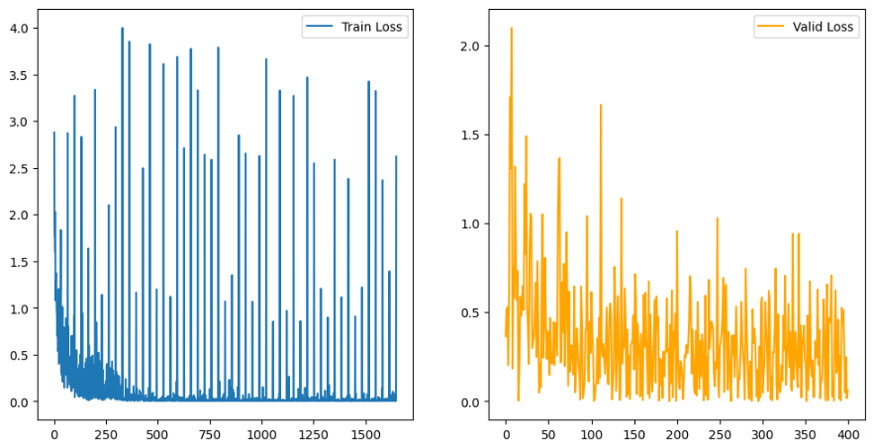

# Environmental Sound Classification

1. [Separation](#분리)
2. [Classification](#분류)

---
# Separation
Separating superimposed sounds from the environment into a single sound

## Demucs
[Demucs](https://github.com/facebookresearch/demucs) is a music source separation model that supports drum, bass, and vocal separation based on U-Net convolutional architecture.

For each input file, we generated four output files.

---
# Classification
Classifying each single sound by analyzing what it is

## Dataset
ESC-50, AI-Hub 소음 환경 음성인식 데이터, UrbanSound8K

+ __630 Data__
  + 513 Train Data
  + 117 Validation Data

+ __13 Categories__
  + dog
  + cat
  + rain
  + wind
  + thunderstorm
  + human
  + conversation
  + siren
  + car horn
  + train
  + steet_music
  + Clock alarm
  + Door Knock

## Data preprocessing
### librosa
Since we need to extract sound features for audio data classification, we use [librosa](https://github.com/librosa/librosa), a music and sound analysis library.

### melspectrogram
For feature extraction, we use a mellspectrogram, which is a spectrum with frequency units replaced by mell units, the units of sound heard by humans.

+ __def get_melspectrogram_db__
: With this function, we converted the audio data into a mellspectrogram, and converted it to a dB (decibel) scale so that the frequency changes are easier to see.

+ __def spec_to_image__
: This function normalized, scaled, and converted the input spectrogram to an image.

|waveplot|melspectrogram|
|:-:|:-:|
|||

## ResNet-34
Using PyTorch [RESNET34](https://pytorch.org/vision/main/models/generated/torchvision.models.resnet34.html) to classify segmented voice data

ResNet is a CNN model that results from stacking multiple residual blocks. ResNet proposed Residual Blocks with Skip Connections to address the problem of overfitting or gradient vanishing as the layer gets deeper.

## Model Performance

+ Epoch-50 Train-Loss: 0.0989
+ Epoch-50 Valid-Loss: 0.271
+ Valid-accuracy: 0.91
  
# Used Libraries
- [URBANSOUND8K](https://urbansounddataset.weebly.com/urbansound8k.html)
- [AI HUB: 소음 환경 음성인식 데이터](https://www.aihub.or.kr/aihubdata/data/view.do?currMenu=115&topMenu=100&aihubDataSe=realm&dataSetSn=568)
- ESC50
  > K. J. Piczak. **ESC: Dataset for Environmental Sound Classification**. *Proceedings of the 23rd Annual ACM Conference on Multimedia*, Brisbane, Australia, 2015.
  >
  > [DOI: http://dx.doi.org/10.1145/2733373.2806390]

---
# Members
|||
|:-:|:-:|
|Hyeonji Roh [@hyeonjiroh](https://github.com/hyeonjiroh)|Yunju Nam [@SouthYunnnn](https://github.com/SouthYunnnn)|
